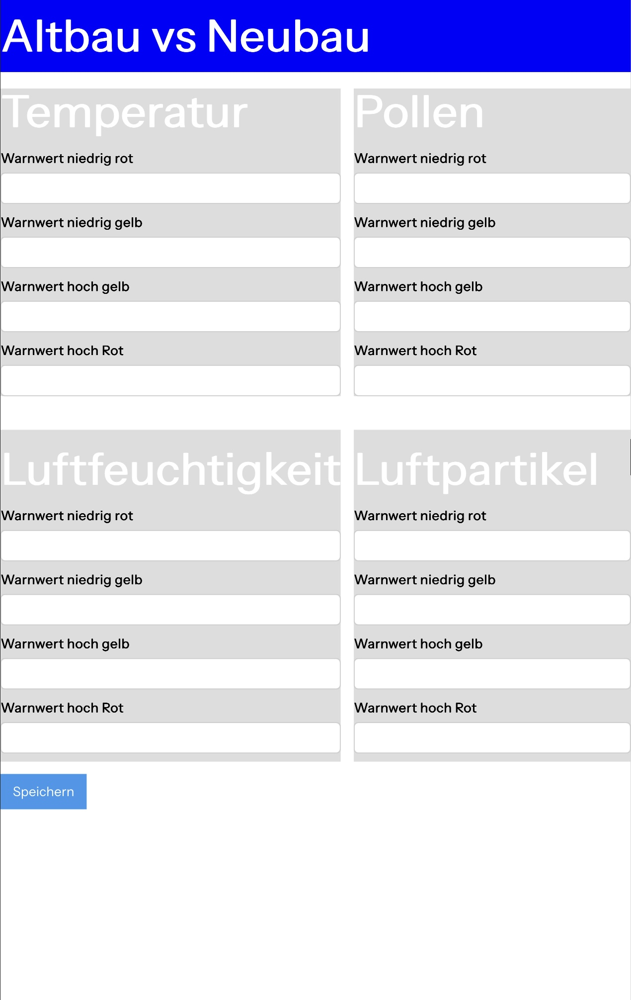

# Anforderungen an das Frontend

## Funktionale Anforderungen

1. **Anzeige aktueller Messwerte**
   - Darstellung der aktuellen Werte für folgende Metriken:
     - Temperatur  
     - Luftfeuchtigkeit  
     - Pollenbelastung  
     - Feinstaub (Feinpartikel)
   - Werte werden in kurzen Intervallen aktualisiert.

   **Begründung:** Nutzer benötigen einen schnellen Überblick über die aktuellen Umgebungsbedingungen, um informierte Entscheidungen treffen zu können (z. B. Fenster schließen, Aktivitäten im Freien vermeiden, Maske tragen).

2. **Visualisierung historischer Daten**
   - Darstellung der Verlaufsdaten als Liniendiagramme (Zeitreihen).
   - Auswahl verschiedener Zeiträume (z. B. letzte Stunde, 24 h, Woche, Monat).
   - Vergleich zwischen zwei Gebäuden:
     - *Altbau* (Marienstraße)
     - *Neubau* (Hanns Voith Campus)

   **Begründung:** Zeitreihendiagramme ermöglichen das Erkennen von Trends, Mustern und Unterschieden im Zeitverlauf sowie zwischen verschiedenen Gebäuden.

3. **Anpassbare Warnschwellen**
   - Benutzer können individuelle Grenzwerte definieren (z. B. Temperatur, Feinstaub).
   - Überschreitungen werden visuell hervorgehoben (z. B. Farbänderung, Warnsymbol).

   **Begründung:** So können Nutzer die App an ihre persönlichen Bedürfnisse anpassen.

4. **Lokale Speicherung von Einstellungen**
   - Benutzerdefinierte Warnwerte und Zeiteinstellungen werden in der Datenbank gespeichert.
   - Beim erneuten Öffnen der Anwendung werden diese automatisch geladen.

   **Begründung:** Dadurch ist eine einfache Personalisierung möglich, ohne dass ein Benutzerkonto oder eine Authentifizierung notwendig ist.

5. **Fehlermeldungen bei Systemproblemen**
   - Benutzerfreundliche Anzeige bei:
     - Nicht-Erreichbarkeit der Anwendung (z. B. Netzwerkfehler, Backend nicht verfügbar)
     - Fehler beim Laden aktueller Daten
   - Klare Hinweise zur Ursache und möglichen Lösungsansätzen.

   **Begründung:** Eine transparente Fehlerkommunikation erhöht das Vertrauen der Nutzer und reduziert Frustration bei technischen Problemen.

---

## Technische Anforderungen

- **Datenvisualisierung:**  
  Verwendung von **Recharts** (bevorzugt gegenüber Chart.js) zur Darstellung von Liniendiagrammen.

  **Begründung:**
  - Recharts ist nativ für React entwickelt und bietet eine deklarative Syntax.
  - Unterstützt dynamische Aktualisierungen und Vergleichsdarstellungen.

- **Styling:**  
  Einsatz von **Tailwind CSS** für Layout und Design.

  **Begründung:**
  - Fördert ein konsistentes, responsives UI-Design.
  - Reduziert die Komplexität im CSS-Management und vermeidet Namenskonflikte.

- **Authentifizierung:**  
  **Es wird keine Authentifizierung implementiert.**

  **Begründung:**
  - Die Anwendung zeigt ausschließlich öffentliche, nicht-personenbezogene Umweltdaten.
  - Nutzer speichern keine sicherheitsrelevanten oder persönlichen Informationen.
  - Einstellungen werden gespeichert und sind aber nicht geräteübergreifend relevant.
  - Eine Authentifizierung würde unnötig Komplexität (z. B. Login-System, Token-Handling) verursachen, ohne Mehrwert für die Anwendung.

- **Performance:**
  - Schnelle Ladezeiten und flüssiges Umschalten zwischen Zeiträumen und Gebäuden.

---

## Wireframe

