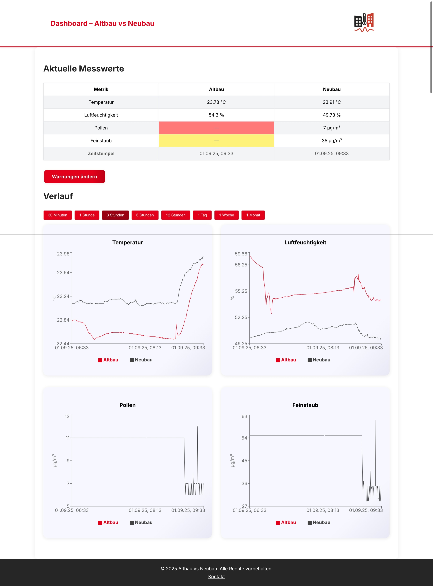
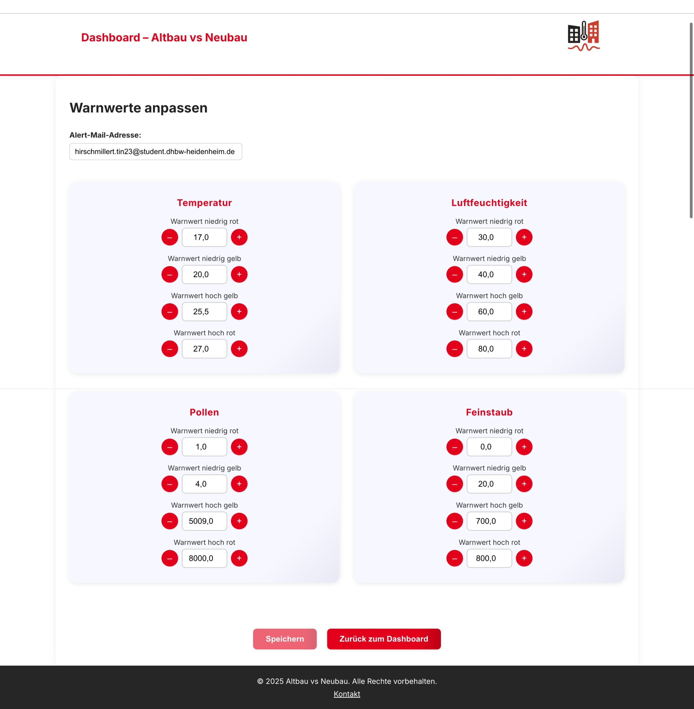

# Altbau vs Neubau – Frontend Documentation

## Overview

This React frontend visualizes sensor data and warning thresholds for the "Altbau vs Neubau" project. It provides a dashboard for live and historical metrics, as well as a page for viewing and managing warning values.

## Detailed Page Documentation

- [Dashboard Page](./frontend_dashboard.md)
- [Warnings / Thresholds Page](./frontend_warnings.md)
- [Confirm Email Page](./frontend_confirm-email.md)

## Structure

- **Main Entry:** `src/App.js`
- **Pages:**
  - `src/pages/Dashboard.jsx` – Main dashboard with charts and metric selection
  - `src/pages/Warnings.jsx` – Warning thresholds overview and management
  - `src/pages/ConfirmEmail.jsx`- Page for email confirmation (Double opt in)
- **Assets:** Images and static files in `src/assets/`
- **Components:** Components for Pages in `src/components/`
- **Styling:** Global styles in `src/App.css` and component-specific classes

## Routing

Uses [react-router-dom](https://reactrouter.com/) for navigation:

| Path            | Component   | Description                  |
|-----------------|------------|------------------------------|
| `/`             | Dashboard  | Main dashboard view          |
| `/warnings`    | Warnings   | Warning values management    |
| `/confirm-email`    | ConfirmEmail   | Confirm Email for alerting   |

## Main Features

- **Header:** Displays project title and logo.
- **Dashboard:** Interactive charts for metrics (temperature, humidity, pollen, particulate matter) with interval selection and per-chart line toggling.
- **Warnings:** Show and set current warning thresholds.
- **Footer:** Contains copyright and contact-link

## Data Flow

- Sensor and threshold data are fetched from the backend API.
- State management is handled via React hooks.
- Changes to thresholds or email addresses are validated and sent to the backend.

## Key Components

- `CurrentValuesTable`: Shows latest sensor readings.
- `ChartCard` & `ChartModal`: Interactive charts for historical data.
- `IntervalButtons`: Select time intervals for charts.
- `WarningsForm`: Edit and save warning thresholds.
- `ErrorMessage` & `LoadingIndicator`: User feedback and loading states.

## Screenshots

## Development Notes

- All pages and components are modular and easy to extend.
- Use `src/components/` for reusable UI elements.
- For new features, add components and update routing in `App.js`.