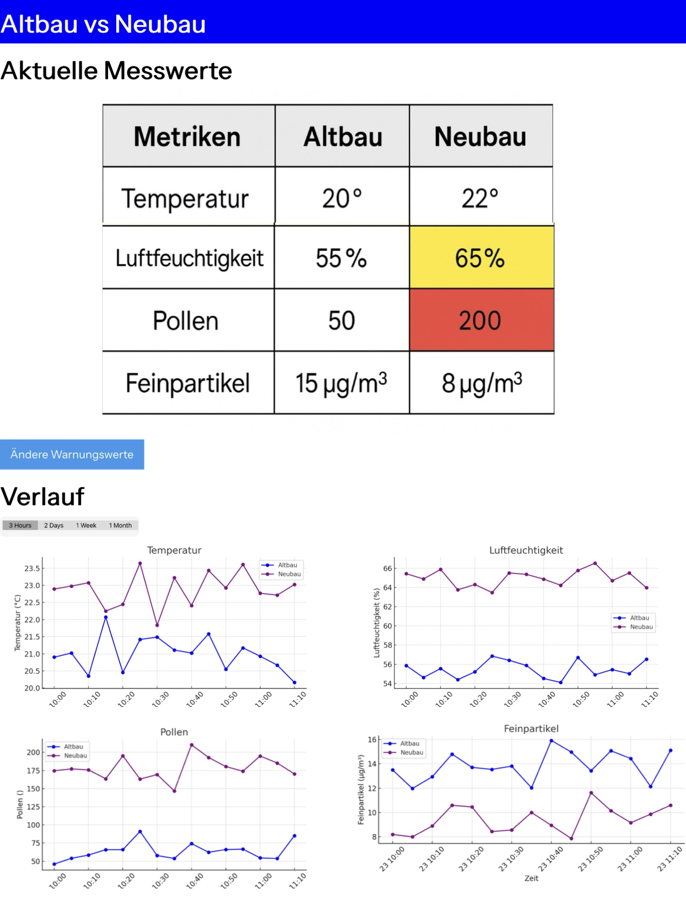

# Frontend Requirements

## Functional Requirements

1. **Display of Current Measurements**
   - Show current values for the following metrics:
     - Temperature  
     - Humidity  
     - Pollen load  
     - Fine dust (particulate matter)
   - Values are updated at short intervals.

2. **Visualization of Historical Data**
   - Display time series data as line charts.
   - Select different time ranges (e.g., last hour, 24 h, week, month).
   - Compare two devices (Arduino with three sensors)

3. **Customizable Warning Thresholds**
   - Users can define individual thresholds.
   - Exceeding thresholds is visually highlighted (e.g., color change, warning icon).
   - The user can register his email address to receive alert on thresholds via email.

4. **Local Storage of Settings**
   - User-defined warning values and time settings are stored in the database.
   - These are automatically loaded when the application is reopened or every 30 seconds.

5. **Error Messages for System Issues**
   - User-friendly display for:
     - Application unavailability (e.g., network error, backend not available)
     - Errors loading current data
   - Clear indications of the cause and possible solutions.

---

## Technical Requirements

- **Data Visualization:**  
  - Use **Recharts** (preferred over Chart.js) for line chart visualization.

- **Authentication:**  
  - No authentication will be implemented.

- **API**
  - Easy Access to the sensor data from the database

---

## Wireframe

### Home screen

### Threshold screen

