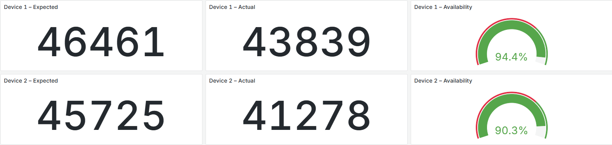
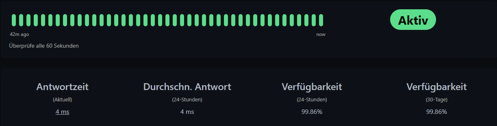

# Functional Requirements

- **FR-01:**  
  The software must record temperature and particulate matter values every 10 seconds and automatically send them to the data platform.

- **FR-02:**  
  All sensor data must have a timestamp and a precise assignment to the location (old or new building) and be stored in a central database to enable time series comparisons between locations.

- **FR-03:**  
  Warning thresholds (temperature too high, poor air quality) must be defined and taken into account.

- **FR-04:**  
  The user interface should allow graphical display of temperature and particulate matter data for both locations.

- **FR-05:**  
  The system must automatically generate a warning when measured environmental values exceed defined thresholds.  
  The warning must be visually displayed in the dashboard and the user should receive a push notification.

---

# Non-Functional Requirements

- **NFR-01:** The system must ensure that at least **70.00%** of sensor data per day is successfully transmitted and stored.  
  If a sensor does not send data for more than 10 minutes, the system must automatically detect and log this.

  ### Measurement Method:
  - **Log Analysis:**
      - Calculate how many measurements per sensor per day are expected (target values).
      - Query actually stored values in TimescaleDB (actual values).
      - `Availability = actual/target`
      
  - **Timeout Monitoring:**
      - Backend logs when a sensor does not send data for >10 minutes.

- **NFR-02:** The web interface must guarantee an availability of at least **95%**.  
  Errors must be clearly indicated to users through understandable error messages.

  ### Measurement Method:
  - **Monitoring:**
    - External monitoring tool (possibly self-hosted)
    
  
- **NFR-03:** Visualization of room quality data in the dashboard must be fully loaded within **2 seconds** after a user request, even with simultaneous use by up to 20 users.

  ### Measurement Method:
  - **Monitoring:**
    - External monitoring tool (possibly self-hosted)
    - Load test with 20 parallel users
    ## Our Test Statistics

The load test was executed with **20 virtual users** and a **30-second ramp-up**.  
The configured **total test duration was 180 seconds (3 minutes)**.
Given an observed per-endpoint throughput of ~**6.9 req/s**, this yields about  
**1,200 requests per endpoint** (≈ 1,233 samples). The overall scenario produced **8,646 requests**.

| Label                                | Samples | Errors | Error % | Avg (ms) | Min | Max  | p50  | p90   | p95   | p99    | Throughput/s | KB/sec | Avg. Bytes |
|--------------------------------------|---------|--------|---------|----------|-----|------|------|-------|-------|--------|--------------|--------|------------|
| **Total**                            | 8646    | 0      | 0.00%   | 148.24   | 0   | 2581 | 58.0 | 467.0 | 526.0 | 686.53 | 48.31        | 8039.51| 11.95      |
| GET http://hrschmllr.de:3000/        | 1233    | 0      | 0.00%   | 516.49   | 354 | 1765 | 494.0| 600.6 | 708.2 | 899.98 | 6.89         | 4006.76| 5.95       |
| GET http://hrschmllr.de:3000/-0      | 1233    | 0      | 0.00%   | 45.91    | 26  | 388  | 40.0 | 61.0  | 67.3  | 149.64 | 6.91         | 7.44   | 0.82       |
| GET http://hrschmllr.de:3000/-1      | 1233    | 0      | 0.00%   | 75.56    | 29  | 414  | 71.0 | 105.0 | 112.0 | 128.66 | 6.91         | 105.64 | 0.92       |
| GET http://hrschmllr.de:3000/-2      | 1233    | 0      | 0.00%   | 52.24    | 29  | 568  | 43.0 | 67.0  | 84.6  | 222.28 | 6.91         | 7.28   | 1.09       |
| GET http://hrschmllr.de:3000/-3      | 1233    | 0      | 0.00%   | 46.53    | 28  | 319  | 42.0 | 64.0  | 70.0  | 102.96 | 6.94         | 7.79   | 1.13       |
| GET http://hrschmllr.de:3000/-4      | 1233    | 0      | 0.00%   | 247.65   | 159 | 1153 | 235.0| 298.0 | 329.3 | 538.28 | 6.93         | 3849.78| 1.00       |
| GET http://hrschmllr.de:3000/-5      | 1233    | 0      | 0.00%   | 42.12    | 27  | 155  | 38.0 | 58.0  | 62.0  | 90.98  | 6.94         | 53.90  | 1.02       |
| **TTLB Dashboard**                   | 1240    | 0      | 0.00%   | 2004.27  | 0   | 3298 | 2008.5| 2435.0| 2498.9| 2717.26| 6.87         | 3973.04| 5.90       |

- **NFR-04:** The system's source code must be modular and documented so that changes to individual components (e.g., sensor protocol, visualization) can be made without affecting other parts. Additionally, there must be at least one automated component test for each main component.

  ### Measurement Method:
  - **Backend structure in Flask**
      -`mqtt/` (MQTT handler)
      -`storage/`(DB access)
      -`api/`(REST endpoints)
      -`test/`(Unit and integration tests)
  - **GitHub Actions CI/CD**
      - Automatic test run for every pull request to `main`

  - **Documentation**
      - OpenAPI schema for REST
      - README + short developer documentation
        
- **NFR-05:** The system must be designed so that it remains operational in the event of sensor failures or connection interruptions and automatically attempts to reconnect within **5 seconds**.  
  Failed data transmissions must not cause a system crash but must be logged and, if necessary, temporarily stored in a queue.

  ### Measurement Method:
  - **MQTT client in Flask**
    - Reconnect logic every 5 seconds if broker is lost
  - **System remains operational** even without all sensors --> Frontend shows "Sensor offline"
 
- **NFR-06:** The software components must be provided in containers (e.g., using Docker) to enable easy platform switching (e.g., from a local server to a cloud VM) without code changes. Additionally, the system must be successfully installed and operated on at least two different operating systems (e.g., Linux and Windows).

  ### Measurement Method:
  - Docker setup with:
      -`backend-api`
      -`backend-mqtt`
      -`react-frontend`
      -`timescaledb`
  - Docker Compose for local development + deployment
  - CI/CD test on Linux + Windows via Github Actions
  - Environment variables for all paths and secrets instead of hardcoding

---

| **System Element**        | **Function**                                | **Possible Failure**                       | **Cause**                                | **Impact**                             |
|--------------------------|---------------------------------------------|--------------------------------------------|------------------------------------------|----------------------------------------|
| Arduino                  | Collect sensor data                         | Sensor does not provide data               | Sensor defective, cable break, power loss| No data in DB / on website, affects other sensors |
| Temperature sensor       | Measure temperature                         | Temperature not measured correctly         | Sensor miscalibrated / damaged           | Incorrect display on website           |
| Air quality sensor       | Measure air quality                         | No or incorrect measurements               | Sensor miscalibrated / damaged           | Incorrect display on website           |
| MQTT connection          | Transmit data from Arduino to server        | Connection drops                           | Network failure, broker unreachable      | Data loss / no display                 |
| MQTT broker              | Receive measurement data                    | Broker unreachable                         | Server failure                           | Data lost, system unusable             |
| Database                 | Store data                                  | Data not stored                            | Database server unreachable / faulty      | No history / display on website        |
| Website                  | Display measurement data                    | Site unavailable, connection to backend fails| Server down, DNS issues, backend error   | User cannot see data                   |
| Web server               | Host website                                | Web server offline                         | Power outage, hosting issues             | No data display                        |

_Last updated: 14.08.2025_

---
# Quality Attributes 
- Reliability
- Fault tolerance
- Performance